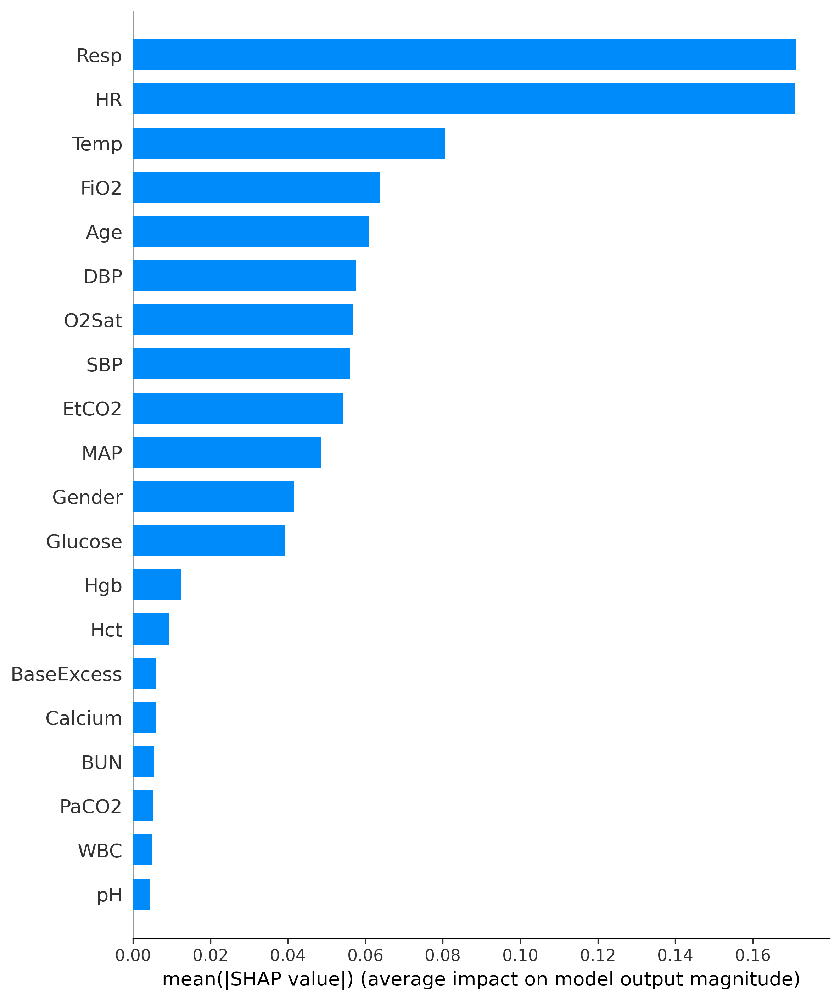

# Temporal Early Warning of Sepsis Deterioration in ICU Patients

## Overview
This repository implements a patient-level early warning framework for prospective sepsis risk prediction in ICU settings. The emphasis is placed on temporal validity, prevention of information leakage, and clinically meaningful interpretability rather than retrospective event detection.

The implementation is intended as a research-oriented prototype aligned with clinical machine learning constraints, not as a production-ready system.

## Problem Formulation

The task is formulated as prospective risk prediction within a fixed future horizon. At each ICU hour, the model estimates the probability of sepsis onset occurring within the next predefined time window, explicitly avoiding retrospective labeling schemes.

## Data Handling and Temporal Integrity
All preprocessing preserves strict within-patient temporal ordering. Train–test partitioning is performed at the patient level to prevent leakage across correlated ICU time points.

No feature engineering relies on future observations.

## Early Warning Label Construction

Early warning labels are assigned to observations that fall within a fixed prediction horizon preceding the first recorded sepsis onset for each patient. This formulation reflects a clinically actionable early warning setting rather than post hoc detection.

## Modeling

A gradient-boosted decision tree model (LightGBM) is trained under extreme class imbalance. Model configuration prioritizes stable discrimination and generalization over aggressive optimization.

## Evaluation

Performance is reported using threshold-free metrics (AUROC and PR-AUC) to reflect pre-deployment discrimination under severe outcome imbalance. No operating threshold is tuned or optimized in this study.

## Interpretability

Global feature attributions are examined using SHAP to inspect dominant physiological drivers influencing risk estimates.

See global feature importance visualization: 

Interpretability analysis is used for model inspection rather than causal inference.

## Notes

This repository prioritizes methodological validity and transparency over metric maximization. Observed performance should be interpreted in the context of the chosen early warning horizon and the intrinsic difficulty of the prediction task.
